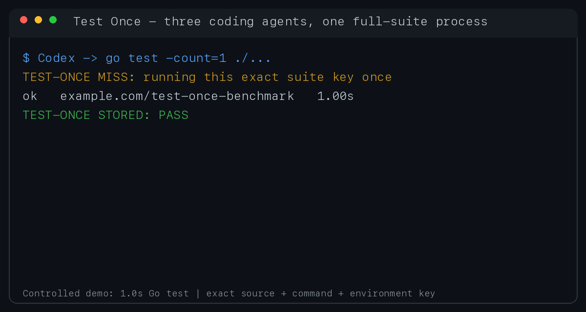

# Test Once

[](https://github.com/MascaraDeemo/test-once/actions/workflows/ci.yml)
[](https://github.com/MascaraDeemo/test-once/releases/latest)
[](LICENSE)

**Run an expensive full test suite once per exact source snapshot, then reuse
the passing result across Codex, Claude Code, and Cursor sessions.**



For an exact repository snapshot, test command, environment, platform, and
toolchain fingerprint, the underlying suite runs at most once at a time.
Passing results are reused; failures are never cached. Local statistics report
avoided runs without telemetry and separate nominal test work from optional
warm-calibrated wall-time savings.

## Measured result

This controlled benchmark sends three independent requests for the same native
suite. The test body lasts only one second, so Test Once's fixed lookup costs
remain visible.

| Suite | Direct ×3 | Test Once ×3 | Underlying runs | Cache hits | Wall time saved |
| --- | ---: | ---: | ---: | ---: | ---: |
| Go (`go test -count=1 ./...`) | 4.207s | 1.968s | 1 | 2 | 2.240s (53.2%) |
| TypeScript (`npm test --silent`) | 4.025s | 2.116s | 1 | 2 | 1.909s (47.4%) |

The totals include Python startup, Git source fingerprinting, environment and
toolchain detection, locking, and cache lookup. Results are the median of three
trials on macOS arm64. See the
[methodology and reproducible benchmark](benchmarks/README.md).

For a runner that forces fresh execution, `N` identical requests and a suite
duration of `T` avoid `(N - 1) × T` of test processes. Native caches can make
ordinary reruns much cheaper, so Test Once does not present that nominal work
as actual wall time saved.

## Real-world repositories

We also tested official full-suite commands on two high-star repositories and
compared against their native warm-cache behavior, not `first run × 3`.

| Repository | Native command | Native warm rerun | Test Once hit | Three-request wall time |
| --- | --- | ---: | ---: | ---: |
| Syncthing, Go (87,112 stars) | `go run build.go test` | 2.63s | 0.21–0.22s | 65.97s → 61.42s (6.9%) |
| Microsoft/TypeScript (110,015 stars) | `npm test` | 72.53s | 1.15–1.25s | 285.75s → 145.15s (49.2%) |

Go's native test cache already made Syncthing reruns inexpensive. TypeScript
cached its build and lint work but still reran 106,371 tests. This distinction
is the reason v0.2.2 separates nominal and calibrated savings. See the
[real-world methodology and limits](benchmarks/real-world.md).

## Install

All three integrations use the same runner, repository configuration, and
machine-local cache. A passing result produced through one agent can be reused
by the others.

### Codex

```bash
codex plugin marketplace add MascaraDeemo/test-once --ref main
codex plugin add test-once@test-once
```

Start a new Codex task after installation. Review and trust the plugin hook
when Codex prompts you; plugin hooks are never trusted automatically.

### Claude Code

```bash
claude plugin marketplace add MascaraDeemo/test-once
claude plugin install test-once@test-once
```

Run `/reload-plugins` or start a new Claude Code session after installation.

### Cursor

Until Test Once is listed in the Cursor Marketplace, install the full local
plugin from GitHub:

```bash
git clone https://github.com/MascaraDeemo/test-once.git \
  ~/.cursor/plugins/local/test-once
```

Restart Cursor or run **Developer: Reload Window**. The local plugin includes
both the Agent Skill and the deterministic `preToolUse` hook.

Then ask any supported agent:

```text
Configure Test Once for this repository's full test suite.
```

To update the Codex installation later:

```bash
codex plugin marketplace upgrade test-once
codex plugin add test-once@test-once
```

## Why the key is more than `HEAD`

A commit ID alone is not enough to prove that two test inputs are identical.
Test Once also accounts for:

- dirty tracked files, staged changes, and untracked files;
- initialized submodules and sparse-checkout state;
- the configured full-suite command;
- operating system and architecture;
- selected environment variables and relevant default variables;
- the executable and toolchain version.

Clean Git worktrees that share the same common repository directory and commit
share a result. Separate clones remain isolated.

## Requirements

- Codex, Claude Code, or Cursor with lifecycle-hook support
- Git
- Python 3.10 or newer
- macOS or Linux

Windows is not supported in the current release; its locking and
process-control paths have not been verified.

The runner is language-agnostic. Go, TypeScript, Rust, Python, Java, Bazel, and
other projects work as long as the repository has a deterministic shell
command for its full suite.

## Configure a repository

Use the runner bundled with the plugin. Replace `<plugin-root>` with the installed plugin directory.

For Go:

```bash
python3 <plugin-root>/skills/test-once/scripts/test_once.py init \
  --suite full-ut \
  --command 'go test ./...' \
  --fingerprint-command auto
```

For TypeScript:

```bash
python3 <plugin-root>/skills/test-once/scripts/test_once.py init \
  --suite full-ut \
  --command 'pnpm test' \
  --fingerprint-command auto \
  --env NODE_OPTIONS
```

Use the actual full-suite command from the repository's CI or documentation. Do not substitute a focused-test command.

The command creates `.test-once.json`. Commit that file when every local agent
should use the same policy. Existing `.codex/test-once.json` files remain
readable; the next successful `init` update migrates them to the neutral path.
Add repeated `--match` options for exact alternate spellings that the hooks
should intercept.

If a command is wrapped by `rtk` or `rtk proxy`, Test Once ignores that leading wrapper while matching. `rtk` is optional and is never required to run the plugin.

## Run, inspect, calibrate, and invalidate

```bash
python3 <plugin-root>/skills/test-once/scripts/test_once.py run --suite full-ut
python3 <plugin-root>/skills/test-once/scripts/test_once.py status --suite full-ut
python3 <plugin-root>/skills/test-once/scripts/test_once.py stats --suite full-ut
python3 <plugin-root>/skills/test-once/scripts/test_once.py calibrate --suite full-ut
python3 <plugin-root>/skills/test-once/scripts/test_once.py invalidate --suite full-ut
```

On a miss, the runner acquires a per-key file lock and executes the suite. Concurrent sessions wait for that lock and then reuse the passing result. On a hit it prints:

```text
TEST-ONCE HIT: PASS
```

The result includes the exact key, source identity, command, timestamp, original duration, and retained log path.

Focused tests continue to run normally because the hook rewrites only exact commands configured for a full suite.

`stats` reports:

- `runs_avoided`: full-suite processes that did not need to start;
- `nominal_test_seconds_avoided`: original passing-run durations associated with hits, explicitly not a wall-time claim;
- `calibrated_cache_hits` and `uncalibrated_cache_hits`: measurement coverage;
- `calibrated_wall_seconds_saved`: native warm-baseline time minus hit-resolution time, available only for calibrated hits;
- execution counts for passed, failed, and source-unstable runs.

Only `run` requests affect statistics. `status` checks do not. Statistics are aggregated per repository and suite in the local Test Once cache.

`calibrate` is optional and intentionally reruns the current full suite once.
It requires an existing reusable pass and records a warm baseline only when the
rerun passes without a source change. Use it for honest performance measurement,
not as part of normal cache reuse. Existing schema-1 statistics migrate as
uncalibrated history instead of retaining unverifiable wall-time estimates.

## Configuration controls

- `--env NAME` includes an additional environment variable in the key.
- `--extra-input PATH_OR_GLOB` includes ignored or generated repository files that affect tests.
- `--ttl-seconds N` expires passing results that depend on time-varying external state.
- `--match COMMAND` adds an exact command spelling for hook interception.
- `--fingerprint-command COMMAND` fingerprints a custom toolchain; use `auto` for known tools or `none` only when toolchain changes cannot affect the suite.

The default auto-detection covers common Go, Node.js, Python, Rust, Bazel, Maven, Gradle, and Make toolchains.

## Safety and limits

- Test Once stores data only on the local machine and makes no network requests itself.
- Statistics contain aggregate counters, durations, timestamps, the suite name, and a hash of the local repository identity; they do not contain source, commands, or environment values.
- Test output logs may contain sensitive data. They remain in the local cache under `~/Library/Caches/test-once` on macOS, `$XDG_CACHE_HOME/test-once` when that variable is set on Linux, or `~/.cache/test-once` otherwise.
- Warm-calibration output is another local test log and has the same sensitivity.
- `.test-once.json` contains shell commands. Legacy `.codex/test-once.json`
  files have the same trust requirement. Review the configuration before using
  the plugin in an untrusted repository.
- Ignored files are not part of the source snapshot unless configured with `--extra-input`.
- A cached local pass is not a replacement for required CI, release checks, flaky-test detection, or tests that intentionally exercise changing external systems.
- Only passing results are reusable. A source change during execution prevents the result from being stored.

## Development

Run the integration suite:

```bash
python3 -m unittest discover -s tests -v
```

The tests exercise cache reuse, dirty snapshots, clean worktrees,
single-flight concurrency, savings statistics, failed and unstable runs,
corrupt-stat isolation, environment changes, TypeScript toolchain
fingerprints, Codex/Claude/Cursor hook rewriting, cross-agent single-flight,
configuration migration, release-version alignment, marketplace metadata, and
demo-asset packaging.

## License

Licensed under the Apache License, Version 2.0. See [LICENSE](LICENSE).
